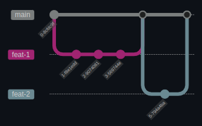

**English (US)** | [Português (BR)](CONTRIBUTING.md)

Contribution Guide
====

This guide is intended to guide people on their journey with Querido Diário. It presents the initial steps that must be taken when interacting across all project repositories.

The repositories also have particularities described in their own documentation. When you finish reading these general guidelines, also read the `CONTRIBUTING-en-US.md` file of the repository of interest before making your contribution.

# Contributing

## Code of Conduct

To ensure our community is welcoming to all people, please read and follow our [Code of Conduct](CODE_OF_CONDUCT-en-US.md).

By participating in this project, you agree to be bound by the terms specified therein.

## Where to contribute

The *Querido Diário* has several code repositories for you to contribute:

- [Documentation and Community](https://github.com/okfn-brasil/querido-diario-comunidade)
- [Scrapers](https://github.com/okfn-brasil/querido-diario)
- [Toolbox](https://github.com/okfn-brasil/querido-diario-toolbox)
- [Infrastructure](https://github.com/okfn-brasil/querido-diario-infra)
- [Frontend](https://github.com/okfn-brasil/querido-diario-frontend)
- [Data Processing](https://github.com/okfn-brasil/querido-diario-data-processing)
- [API](https://github.com/okfn-brasil/querido-diario-api)
- [API Wrapper](https://github.com/okfn-brasil/querido-diario-api-wrapper)
- [Census](https://github.com/okfn-brasil/censo-querido-diario)

## How to contribute

If you have not yet contributed to an open source project or are not familiar with this project, there are tasks for people like you in the [Issues](https://github.com/okfn-brasil/querido-diario-comunidade/issues) tab, labeled as [`good first issues`](https://github.com/okfn-brasil/querido-diario-comunidade/issues?q=is%3Aissue+is%3Aopen+label%3A"good+first+issue").

If any of those interest you, before starting, you can leave comments to ask any relevant questions and then leave a notice that you will be working on that task.

### Figuring out what to contribute

#### Issues
The **Issues** tab of the chosen repository contains tasks or problems specific to that repository. See if one interests you.
- When the task is recommended for beginners, it will have a label with `good first issue`.
- When you find one that interests you, comment that you will do the task. This way, other people will know that you are already working on it, being able to offer help or dedicate yourself to others that have not yet been started.
- Whether or not you have already chosen an *issue* to work on, you can also comment on relevant questions related to the task.

#### Milestones
If there are no open *issues* or none that interest you, see the **Milestones** of the repository of interest. They indicate the goals to be achieved. Exploring the files seeking to find areas for improvement that help the repository reach a *milestone* is an excellent form of contribution.
- When found, open an *issue* describing the possibility of perceived improvement. If you are already carrying out the task, mention it in the message.

#### Discussions
If you have an idea or suggestion for the direction of the project, create a **Discussion** (discussion).
- As Querido Diário is made up of many repositories and discussions tend to have a transversal nature, it is **a management decision to keep them all centralized**. So, to start or follow discussions, just look at the [discussion forum](https://github.com/okfn-brasil/querido-diario-comunidade/discussions).

#### Chat for the community
Join [community on Discord](https://go.ok.org.br/discord). There you can ask questions faster, interact with the people who support it, ask how you could help and even talk to other people who also contribute.

### Interacting with the code reviewer
- Be patient and give the reviewer time. In addition to code reviews being complex and demanding time and attention in themselves, a reviewer may be, like you, another contributor giving up their personal time when possible or have other priorities before being able to review your code.
- Whether in the form of code or with messages asking questions and suggestions, facilitate interaction by being objective, but providing details when necessary.
- During the review, a reviewer can open *threads* requesting improvements to your code. Generally, it is the reviewer's responsibility to decide when the *thread* is finished.

# Keeping responsibilities of a person who maintains Querido Diario

- Respect the [code of conduct](CODE_OF_CONDUCT-en-US.md) and ensure that people have a safe and welcoming environment and that any victim of violation of this term has a help channel;
- Always justify a suggestion according to the practices already adopted in the project, readability and simplicity. It is essential that a civic project has a structure that is as simple as possible for beginners;
- The project must be tested before a *Pull Request* is merged;
- Keep the commit history organized, preferably following the following format where every change in the code base is based on the updated main and is merged with a merge commit:

   

- If a Pull Request has many commits and the messages are not clear, you can *squash* the commits before merging the Pull Request
